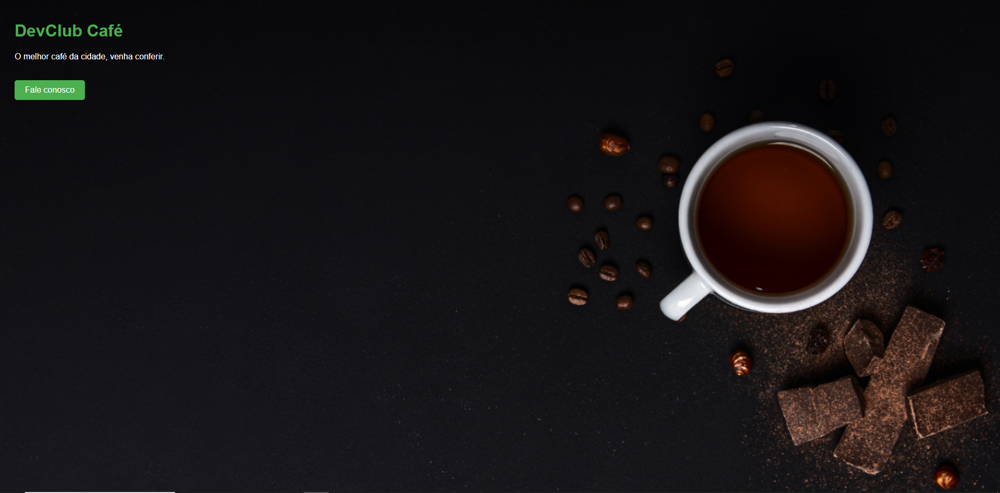

# DevClub Café

Este projeto é uma página web simples para o DevClub Café, apresentando um título, uma breve descrição e um botão de contato.

## 📄 Descrição

O DevClub Café é promovido como o melhor café da cidade. Esta página web fornece uma introdução ao café e um botão para os usuários entrarem em contato.

## 🚀 Tecnologias Utilizadas

- 
- 

## 📂 Estrutura do Projeto

- `index.html` - Arquivo principal do projeto.
- `styles.css` - Arquivo de estilos do projeto.

## 📦 Instalação

Para rodar este projeto localmente, siga as etapas abaixo:

1. Clone este repositório:
   ```bash
   git clone https://github.com/seu-usuario/devclub-cafe.git

🖼️ Screenshot



🎨 Estilos CSS
Os estilos são definidos no arquivo styles.css e incluem classes para estilizar o título, a descrição e o botão de contato.

📧 Contato
Se você tiver alguma dúvida ou sugestão, sinta-se à vontade para entrar em contato comigo através do LinkedIn ou visitar meu portfólio.

Feito com ❤️ por André da Silva Peres.
